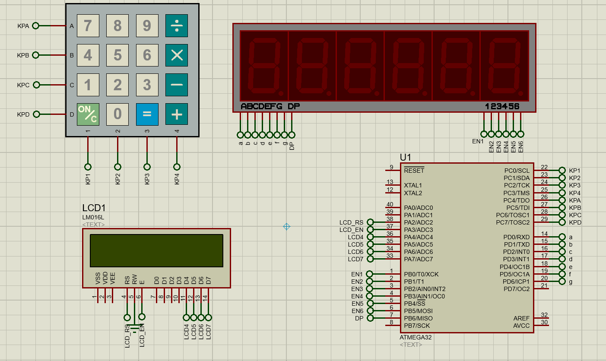

# Real-Time-Clock
Simple embedded project that simulates the behavior of a real time digital clock

## System Componenets
* Atmega32
* LCD
* KEYPAD
* 7-segment (6 digits)

# Library used
* LCD
* Timer0
* Keypad
* 7-segment

## Demo

